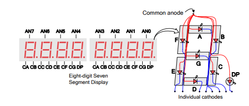
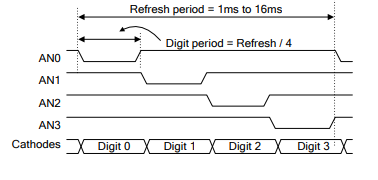

                __   ___   ___      ___  ___  ___
               / /  / _ | / _ )____/ _ \/ _ \|_  |
              / /__/ __ |/ _  /___/ // / // / __/
             /____/_/ |_/____/    \___/\___/____/

               	Create a digital clock with FPGA

                  FPGA-101 / Lessons / Labs
              Copyright 2018-2020 / EnjoyDigital

[> Presentation / Goals
-----------------------
During this lab, we will create a digital clock on the Nexys4DDR.
A digital clock is a simple but interesting first project to do
with an FPGA. If will allow us to create our own modules with
Migen, connect then together, discover a bit more how FPGA are
working and how to control simple peripherals.

Only minimal notions of Migen are required for this lab.
Migen manual can be found at: https://m-labs.hk/migen/manual/

Solutions of lab001 or migen examples design can also be interesting
ressources for this lab. Examples designs of lesson 002 can also be found
in example.

The pinout of the Nexys4DDR's basic IOs is shown below:

Seven Segment schematic:

Seven Segment multiplexing:

[> Architecture
---------------
For more information about the digital clock architecture, please
refers to lesson 002 slides: http://goo.gl/mZJvFQ

[> Instructions
---------------
 1) Execute/Simulate tick.py and understand how it works.
 2) Add a Tick module to the Clock module and configure it to create a 1Hz pulse.
 3) Verify Tick period by creating a Led blinker that uses this tick to blink a led and verify on the board.
 4) Execute/Simulate display.py and fill the missing parts of SevenSegment.
 5) Add a SevenSegment to the Clock module, connect it to a counter (incrementing at 1Hz) and verify on the board that it's working.
 6) Execute/Simulate display.py and fill the missing parts of SevenSegmentDisplay.
 7) Replace the SevenSegment of the Clock module with a SevenSegmentDisplay module and configure it to display "deadbeef".
 8) Execute/Simulate core.py and fill the missing parts of Core.
 9) Add Core module to the Clock module.
10) Execute/Simulate bcd.py and fill the missing parts of BCD.
11) Add BCD submodule to the Clock module (you need one BCD module for each digit). To add a verilog file to the design, use platform.add_source("my_verilog.v")
12) Connect the Core to the BCD modules and the BCD modules to the SevenSegmentDisplay and test on the board.
13) Add a way to configure the clock (at least minutes and hours)

Optional
--------
14) Use a switch to pass in configure mode. Make the mm or hh blink when in configure mode.
15) How would you create a rolling display (that would allow displaying more than 8 digits with the Nexys4DDR)

[> Infos
--------
Some pitfalls:
- The platform defines our IOs and a request on a it can only be done once.
- A request create a Migen Signal() that can be used as others Signals.
- Affectation is done with ".eq()" (equivalent to <= in VHDL).
- Combinatorial logic must be added to self.comb: self.comb += [my_logic].
- Synchronous logic must be added to self.sync: self.sync += [my_logic].
- Migen uses standard Python operators, a "not" in Migen is "~".
